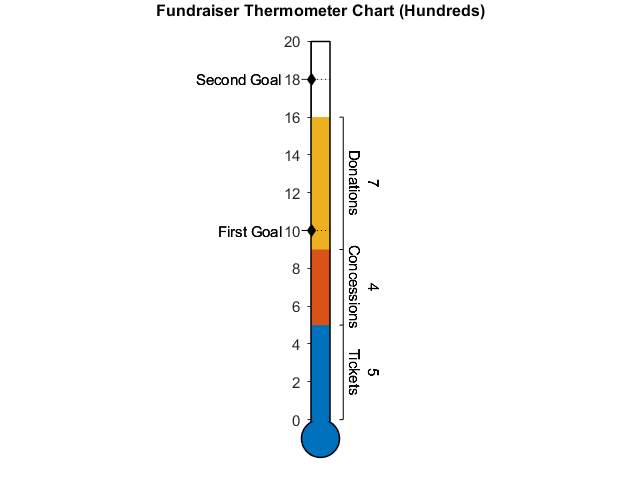

# Thermometer Chart

[](https://www.mathworks.com/matlabcentral/fileexchange/101889-thermometer-chart)

Version: 1.0

Create a thermometer style chart with a stem, bulb, and desired labels, e.g. thermometer plots which are used in reaching fundraising or donation goals. The main body of the thermometer chart displays a circle-shaped bulb connected to a long vertical stem, which are filled in with sectioned-off colors representing quantitative progress according to different categories.



## Syntax
* `thermometerChart(AreaData, Max)` creates a thermometer plot with maximum value specified. AreaData is a vector of 1D data displayed on the thermometer chart. Each quantitity is displayed above the last on the vertical stem, so the final chart is cumulative.
* `thermometerChart(AreaData, Limits)` has similar functionality as `thermometerChart(AreaData, Max)` but specifies minimum, maximum values as a 1 x 2 numerical vector called Limits. 
* `thermometerChart(___, Name, Value)` specifies additional options for the multi-color line plot using one or more name-value pair arguments. Specify the options after all other input arguments.
* `thermometerChart(ax, ___)` creates the thermometer chart in the parent `ax`.
* `h = thermometerChart(___)` returns the thermometerChart object. Use h to modify properties of the plot after creation.

## Name-Value Pair Arguments/Properties
* `AreaData` (1 x n numeric vector) numeric vector where each entry can correspond to a different category. Values in the vector must be positive.
* `AreaLabels` (1 x n string array or cellstr) string array or cellstr which contains the categorical labels corresponding to elements in AreaData. These labels are added to the right of the thermometer stem, rotated to be vertical.
* `GoalData` (1 x m numeric vector) numeric vector of goal values which are marked with tick marks and goal labels along the stem of the thermometer.
* `GoalLabels` (1 x m string array of cellstr) string array or cellstr which contains the labels corresponding to each element in GoalData. For each GoalData element, the corresponding text label is added to one side of the thermometer stem at the goal value. By default these are located on the left side of the thermometer stem.
* `GoalLocation` (string) A string (`'left'` or `'right'`) describing whether or not GoalLabels, if specified, should be placed to the left or right of the thermometer stem.
For a thermometer chart with many AreaLabels on the right, it may be preferred to have GoalLabels located to the left (default setting). For a thermometer chart with no AreaLabels on the right, GoalsLocation may be set to `'right'` such that the goal labels are on the right. 
* `Limits` (1 x 2 numeric vector) minimum and maximum value shown on vertical axis along the thermometer stem. If the second argument to thermometerChart is a scalar, it is used as the maximum value and the minimum value is set to 0.  
* `TitleText`  (n x 1 string vector) title of the plot.

## Example
Create a thermometer chart for a fundraiser according to ticket sales, concessions, and donations. Specify first and second goals for the chart. 

```
areaLabels = ["Tickets", "Concessions", "Donations"];
goalData = [10, 18];
goalLabels = ["First Goal", "Second Goal"];
th = thermometerChart([5, 4, 7], 20, "AreaLabels", areaLabels, "GoalData", goalData, ...
    "GoalLabels", goalLabels);
th.TitleText = "Fundraiser Thermometer Chart (Hundreds)";
```
